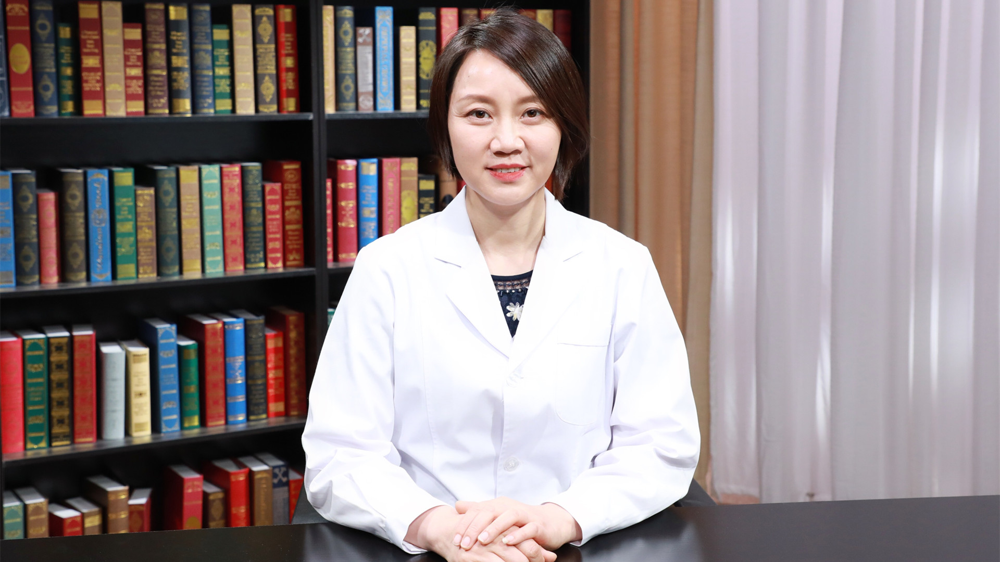

# 29.2 艾滋病检查

---

## 杨晓莉 主任技师

中国人民解放军总医院第三医学中心检验科主任 武警部队艾滋病确认实验室主任 主任技师。

武警检验医学专业委员会主任委员；解放军医学检验专业委员会常务委员；中国医学装备协会理事兼POCT装备技术分会副会长；白求恩检验医学委员会副会长；美国旧金山总医院访问学者。

**主要成就：** 发表文章59篇，SCI论文14篇，累计影响因子27.2；主持国家级课题2项；获武警部队科技进步二等奖1项，三等奖1项，军队医学成果三等奖1项，实用新型专利3项，均为第一完成人。

**专业特长：** 擅长分子生物学检验、免疫学检验。

---
