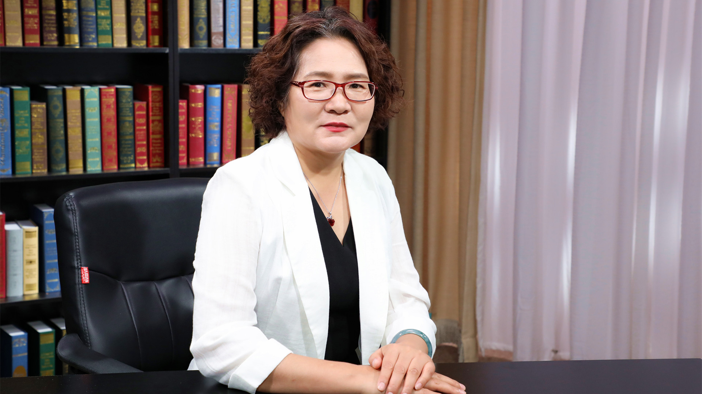

# 29.6 病毒性肝炎的检验

---

## 娄金丽 研究员

首都医科大学附属北京佑安医院临床检验中心主任 医学博士后 研究员 硕士研究生导师。

首都医科大学临床检验诊断学系系务委员会委员；北京中西医结合学会检验分会副主任委员；北京医师协会检验医(技)师分会理事；北京医学检验学会常务理事；中国麻风防治协会皮肤性病检验与诊断分会常务委员；北京医院协会临床实验室管理专业委员会委员；北京市属医院生物安全学科建设专家委员会委员。

**主要成就：** 曾主持完成国家自然科学基金项目；参与国家“十一五”、“十二五”、“十三五”科技重大专项课题的研究；主持并参与多项国家级研究课题，如国家自然科学基金、863、973等课题的研究工作；《标记免疫分析与临床》《国际检验医学杂志》和《北京医学感染与传染研究》杂志编委。

**专业特长：** 擅长肝病基础研究及感染性疾病免疫及分子诊断。

---
