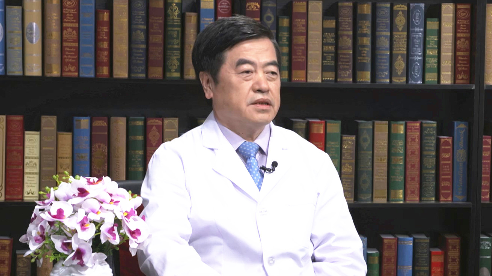

# 29.9 成人先天性心脏病介入治疗

---

## 黄连军 主任医师

首都医科大学附属北京安贞医院介入诊疗科主任 主任医师 博士研究生导师。

中华医学会放射学分会介入学专委会血管组副组长；中国医师协会腔内血管学专业委员会主动脉夹层专家委员会副主任委员；国际静脉联盟中国静脉学会副会长；欧洲心脏病学会会员。

**学术成就：** 获国家科技进步二等奖2项、省部级奖4项；国家发明专利14项、国家实用新型专利12项；第一作者（及通讯作者）发表文章112篇；参加论著编写16部，其中主编2部，副主编2部。

**专业特长：** 擅长心血管疾病X线平片、CT、MRI及心血管造影诊断，擅长各种瓣膜病、各类血管病及先心病介入治疗，擅长各类心血管疾病造影检查技术。已完成上万例心脏及血管病介入治疗。

---
