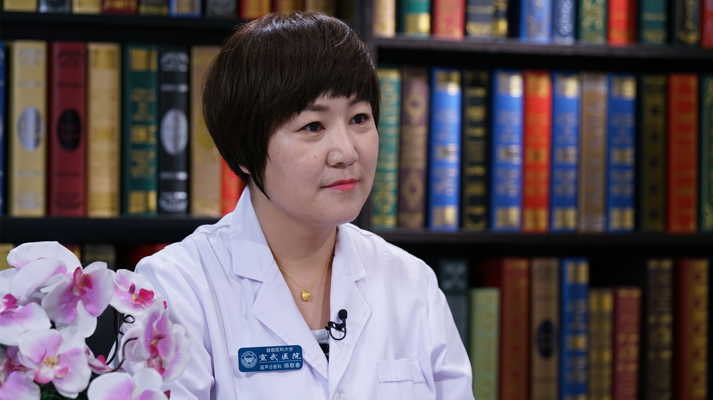

# 29.10 孕期超声检查

---

## 杨敬春 主任医师

首都医科大学宣武医院超声诊断科主任 主任医师 医学博士后 硕士研究生导师。

北京女医师协会超声医学专业委员会副主任委员；中国医疗保健国际交流促进会超声医学分会国际交流学组副主任委员；中华医学会超声医学分会第九届委员会浅表组织和血管超声学组委员；中国医师协会超声分会第一届青年医师委员会常务委员。

**主要成就：** 《中华医学超声杂志（电子版）》编委；在国内外权威期刊杂志发表论著30余篇，其中SCI论著10篇；承担省部级课题3项、局级课题6项、参与多项国家自然科学基金及军队重点攻关课题。

**专业特长：** 擅长甲状腺、乳腺、腹部、浅表组织及小器官、妇产、外周血管、泌尿生殖系统常见病及疑难病的超声诊断及超声引导下穿刺活检和介入治疗。尤其对“双腺”--甲状腺、乳腺疾病，有深入的研究，提出了一站式服务理念，优化甲状腺、乳腺疾病诊治流程，缩短患者就诊时间，使患者得到及时准确的诊治。

---
