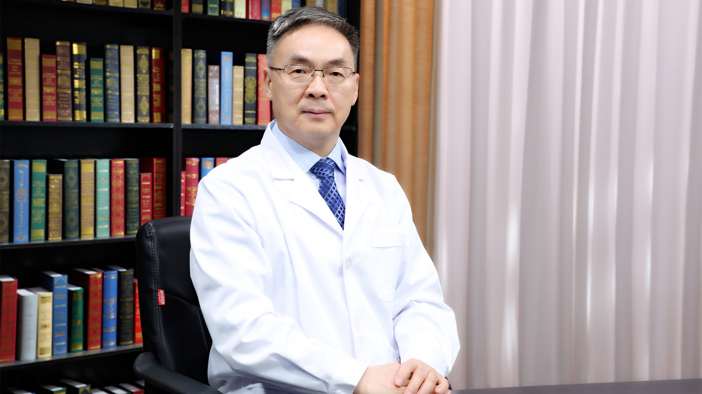

# 29.15 超声诊断颈动脉斑块的稳定性

---

## 何文 主任医师

首都医科大学附属北京天坛医院超声科主任 主任医师 教授 博士生导师 天坛名医。

首都医科大学超声医学系主任；中国医师协会超声医师分会会长；中国医学影像技术研究会副会长；中国医学影像技术研究会超声分会主任委员；国家住院医师规范化培训超声专业委员会主任委员；中华医学会超声医学分会委员；北京超声医学学会副主任委员。

**主要成就** ：2011年获中国医师协会超声分会个人突出贡献奖；2012年获中国优秀超声医学专家称号；2019年获国之名医称号；主持国家自然基金重点项目，面上、国家“十一五”科技攻关课题和国家科技重大专项课题5项，省部级课题7项，获得省部级科技进步奖7项；发表学术论文100多篇，其中SCI收录55篇；培养博士后、博士、硕士研究生60多名。
主编国家卫健委“十三五”研究生规划教材2部，主编著作6部，主译著作1部，副主编教材3部。

**专业特长** ：从事超声诊断和介入性超声33年，开展了全身各部位的超声诊断和各种疾病超声引导穿刺活检、置管引流和消融治疗；主要研究方向是介入性超声和血管超声，在血管超声、腹部超声检查和介入性超声领域经验丰富。

---
