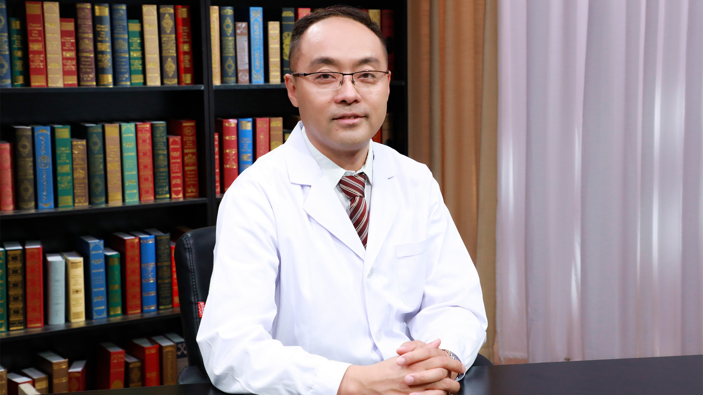

# 29.17 出血与血栓性疾病的实验诊断

---

## 吴俊 主任医师

北京积水潭医院检验科主任 主任医师 北京大学副教授 医学博士后 硕士生导师。

国际血栓与止血学会(ISTH)青年专家工作组(YPTF)委员；中国老年保健学会检验分会血栓与心脑血管病学组组长；北京市临床检验中心血栓与止血专家委员会常务副主任委员；北京检验学会常务委员；北京检验学会血凝学组长。

**主要成就：** 《中华医学检验杂志》《临床检验杂志》《北京大学学报(医学版)》《中国医学科学院学报》等杂志编委及审稿人；参编、副主编著作6部，以第一作者发表论文40余篇，获得多项研究基金；健全各类特殊血凝学实验项目，开展临床动静脉血栓实验室诊断研究；开展血凝学技术全国培训班，培养专业人才40余人。

**专业特长：** 擅长疑难出血性疾病实验诊断、新型血栓标志物研发、遗传及获得性易栓症的诊断、抗栓治疗监测。

---
