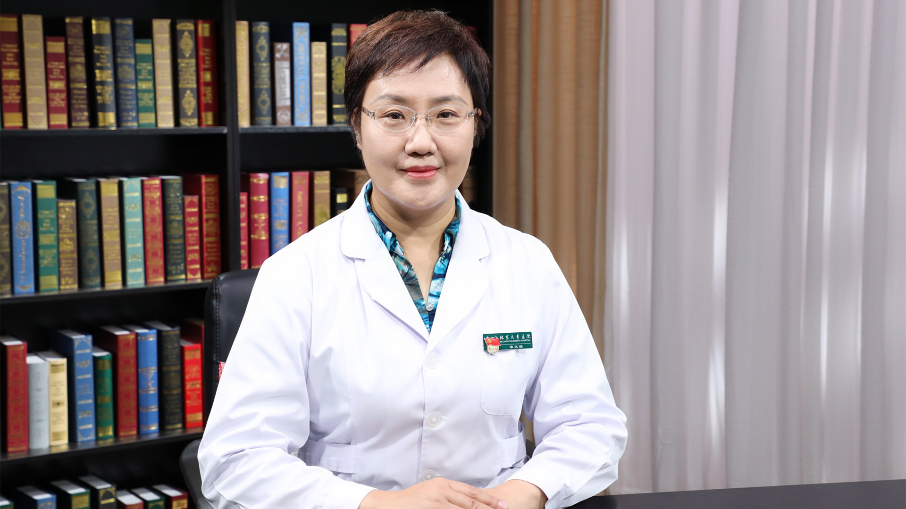

# 29.27 儿童血常规

---

## 宋文琪 主任技师

首都医科大学附属北京儿童医院检验中心主任 首都医科大学临床检验诊断学 硕士研究生导师。

中国医师协会检验医师分会儿科疾病检验医学专家委员会主任委员；中华医学会儿科学分会临床检验学组副组长；中国医师协会青春期临床验证学组组长；北京医学会检验医学分会副主任委员。

**主要成就：** 主持和参与国家自然科学基金面上项目、省部级、北京市卫生健康委员会、北京市医院管理中心等课题9项；近五年作为第一作者和通讯作者发表核心期刊论文25篇和SCI 9篇；参编专业书籍和国家级规划教材12部；目前作为牵头单位，承担中华人民共和国国家卫生健康委员会委托科研任务，在全国开展多中心研究，建立中国儿童临床常规检验指标参考区间及相关行业标准。

**专业特长：** 主要从事实验室管理与儿科临床生物化学方面的研究；擅长应用串联质谱技术进行血液和尿液代谢组学和蛋白质组学研究及儿童肾脏疾病和遗传代谢疾病的生物标志物筛选。

---
