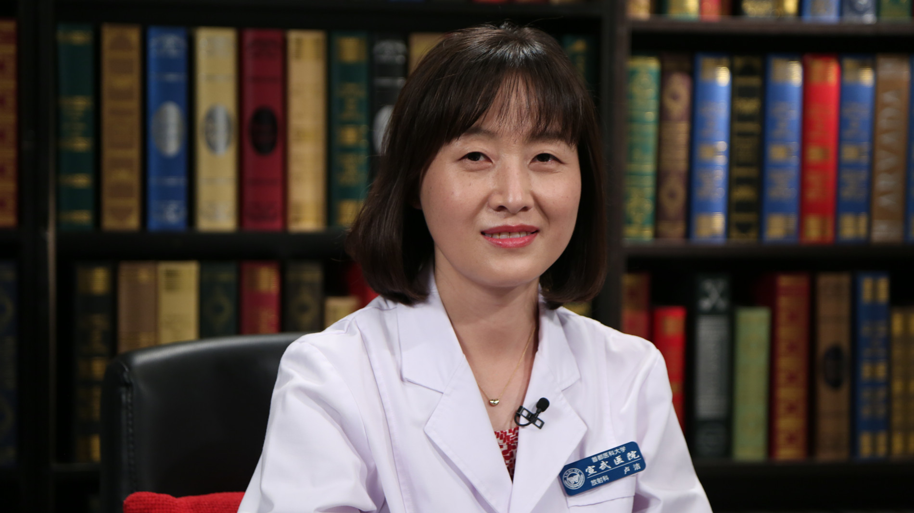

# 29.28 放射科常见问题与误区

---

## 卢洁 主任医师

首都医科大学宣武医院放射科主任 核医学科副主任 主任医师 博士生导师。

中华医学会放射学分会磁共振学组委员；北京神经内科学会神经影像专业委员会主任委员；北京医学会放射学分会副主任委员 ；北京医学会核医学分会副主任委员；磁共振成像脑信息学北京市重点实验室副主任。

**主要成就：** 系列研究获得中华医学科技奖、华夏医学科技奖、教育部科学技术进步奖，并获得科技部十三五重点专项、国家自然科学基金、北京市自然科学基金、北京市医管局临床技术创新项目、登峰项目等支持；发表SCI论文60余篇，参编（译）著10余部，致力于脑功能与分子影像学研究。

**专业特长：** 擅长神经系统疾病的影像学诊断，包括脑血管病、痴呆、帕金森病、癫痫、肿瘤等，尤其对脑血管病、痴呆的影像诊断有深入的研究。

---
