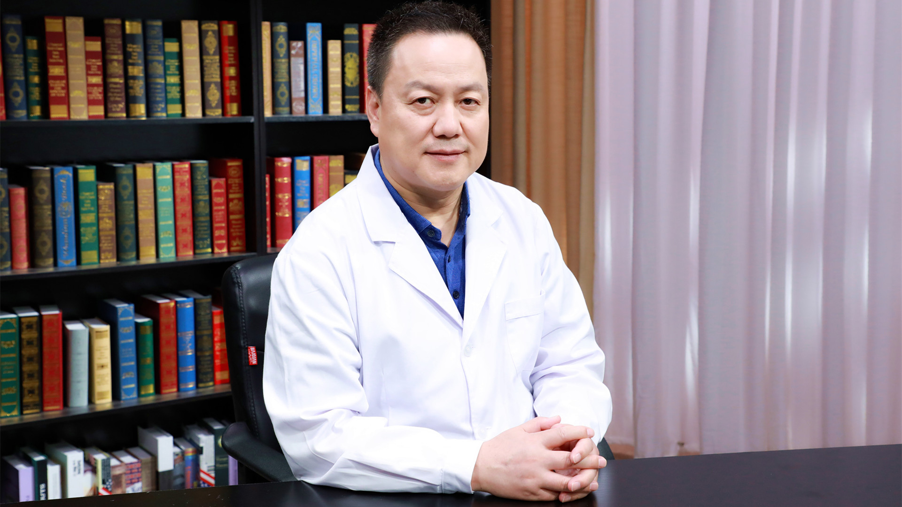

# 29.30 肺癌胸腔镜手术治疗

---

## 高树庚 主任医师

中国医学科学院肿瘤医院副院长 胸外科主任  国家肿瘤质控中心副主任 主任医师 博士生导师。

肺癌微创治疗研究重点实验室主任；中华医学会胸心血管外科学分会副主任委员兼秘书长；中国医师协会胸外科医师分会副会长兼总干事；英国皇家外科学院院士（FRCS）；享受国务院政府特殊津贴专家；中国抗癌协会肺癌专业委员会常务委员；北京医学会胸外科学分会候任主任委员兼肺癌学组组长。

**主要成就：** 作为首席专家牵头制定《2018中华医学会肺癌临床诊疗指南》； “肺癌个体化微创根治相关技术的系统研究及临床应用推广”获2017年中华医学科技奖一等奖、华夏医学科技奖一等奖；“肺癌微创治疗体系及关键技术的研究与推广”获2018年国家科学技术进步奖二等奖；近5年，以第一/通讯作者发表SCI文章19篇，单篇最高影响因子12.46。

**专业特长：** 从事胸部肿瘤外科综合治疗和转化医学研究30年，个人年手术量超1000台，擅长肺部肿瘤的诊断与治疗；开创早期胸部肿瘤精准外科治疗新时代，为推动我国胸部肿瘤外科治疗事业的发展做出突出贡献。

---
