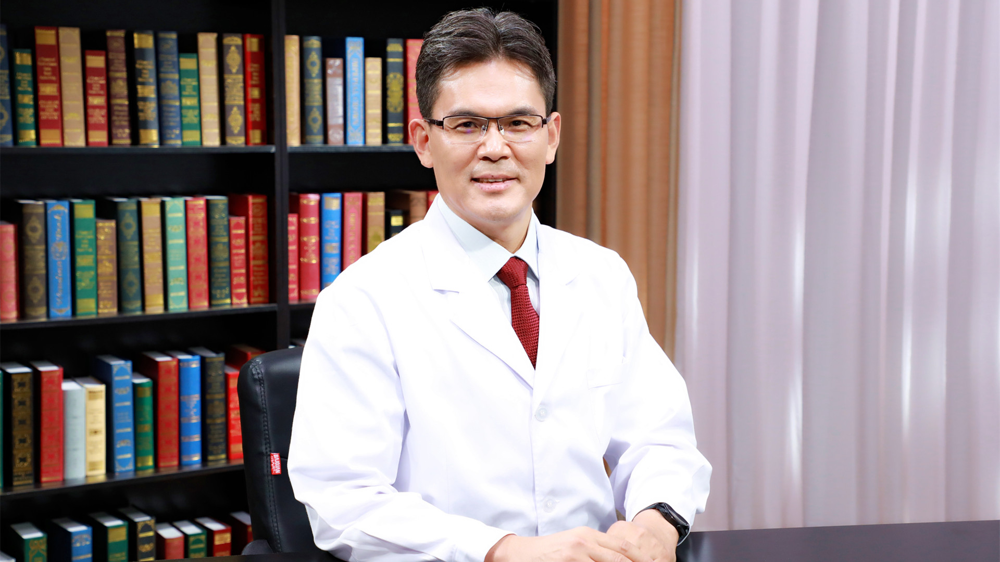

# 29.45 肝血管瘤的射频消融治疗

---

## 孙文兵 主任医师

首都医科大学附属北京朝阳医院西院肝胆胰脾外科主任 主任医师 博士生导师。

中国医师协会外科分会肝脏外科委员会委员；北京市肝胆胰脾外科知名专家团队带头人；北京市肝肿瘤射频消融培训基地负责人；四项国家自然科学基金等多项课题的负责人；《肝血管瘤的射频消融治疗（国内）专家共识》负责人；《我国原发性肝癌消融治疗规范指南》专家组成员。

**主要成就：** 《中华肝胆外科杂志》《国际外科学杂志》《世界华人消化杂志》等杂志的编委；发表SCI论文37篇，IF总分104，国内期刊论文近300篇；获全军科技进步二等奖、三等奖和全军医疗成果二等奖；2002年被解放军总后勤部评为科技新星；2009年被评为首批北京市卫生系统高层次技术人才；2016年获北京市二级教授和“名医”称号。

**专业特长：** 擅长肝脏、胆道、胰腺、脾脏疾病的临床治疗与研究工作，主要研究方向为肝癌的微创和综合治疗。

---
