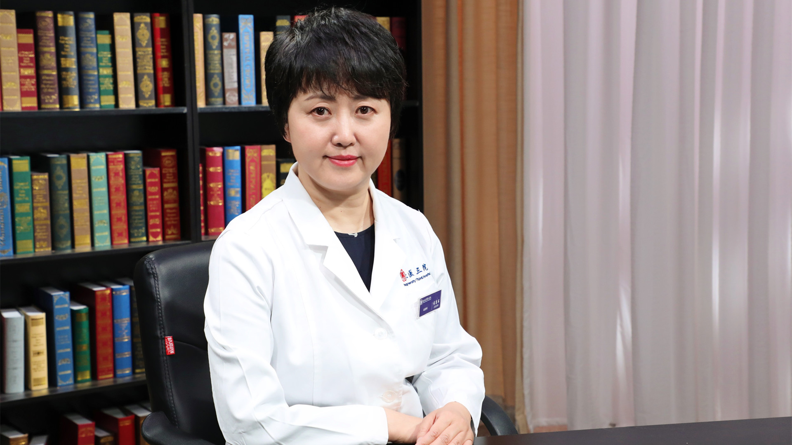

# 29.54 骨关节疾病的影像学诊断

---

## 袁慧书 主任医师

北京大学第三医院放射科主任 主任医师 医学博士 博士生导师。

中华医学会放射学分会骨关节学组组长；中华医学会放射学分会常务委员；北京医学会放射学分会副主任委员；北京医师协会放射影像专科医师分会常务理事；《中华放射学杂志》编委；《临床放射学杂志》骨肌栏目主编。主要成就：致力于骨肌系统疾病影像相关的临床研究，发表SCI论文30余篇，并获得多项国家级、省部级科研项目支持；主编《骨肌系统影像检查指南》《图解骨肌系统影像检查指南》《中华医学影像案例解析宝典-骨肌分册》。专业特长：擅长骨肌系统的影像诊断，特别是运动创伤、脊柱创伤、退变、肿瘤等影像诊断。

---
