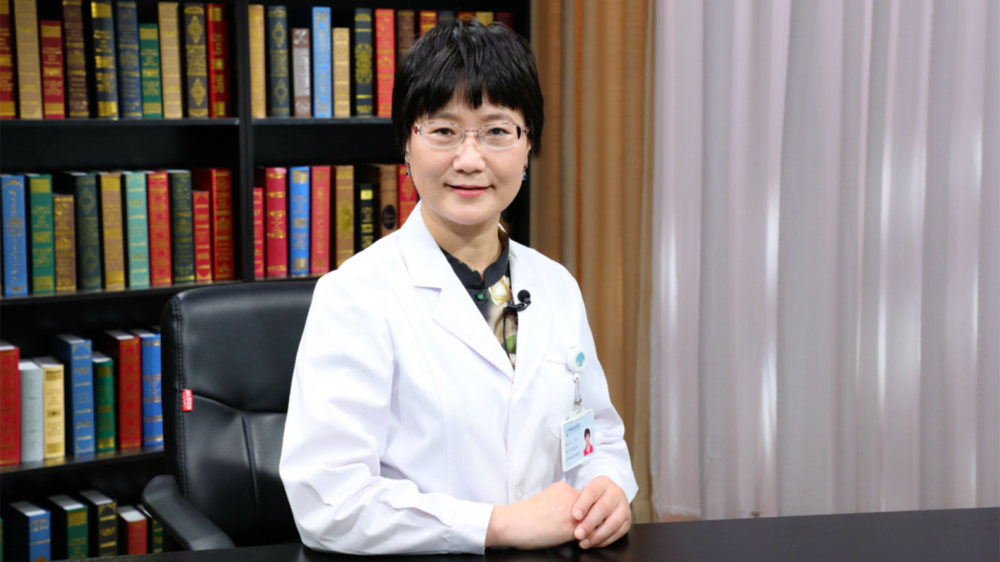

# 29.55 骨髓检验报告解读

---

## 沈军 副主任技师

中日友好医院检验科血液专业负责人。

中日友好医院医联体检验专业督导专家组成员；中国中西医结合学会检验医学专业委员会委员；ISO15189医学实验室认可内审员；国家卫生健康委员会远程会诊专家。

**主要成就 ：** 发表SCI及国内核心期刊论文20余篇，参编书籍3部；参与院级、市级课题3项。

**专业特长：** 擅长骨髓细胞形态学诊断，尤其在MDS（骨髓增生异常综合征）及疑难血液系统疾病的诊断中有非常丰富的经验。

---
