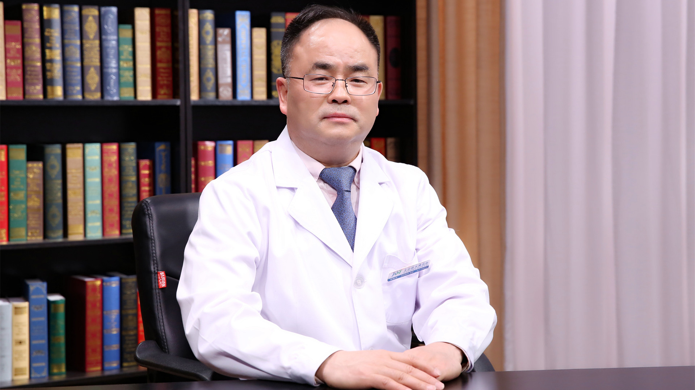

# 29.56 骨质疏松症的影像学诊断

---

## 程晓光 主任医师

北京积水潭医院放射科主任 主任医师 医学博士 博士生导师。

中华医学会骨质疏松和骨矿盐疾病分会副主任委员；亚洲骨放射学会（AMS）主席；中国医师协会放射医师分会常务委员兼骨组组长；中国老年学和老年医学学会骨质疏松分会副主任委员；中华医学会放射学分会骨组副组长。

**主要成就：** 累计发表核心期刊论文300余篇，SCI论文78篇，著作12部；主持国自然、北京市自然和北京首发项目共8项；获北京医学科技奖三等奖。

**专业特长：** 长期从事医学影像学临床与科研工作，尤其在骨科影像学方面具有丰富的临床和科研经验。参与制订我国骨质疏松诊疗指南，建立我国人群骨密度正常参考数据库和诊断标准。

---
