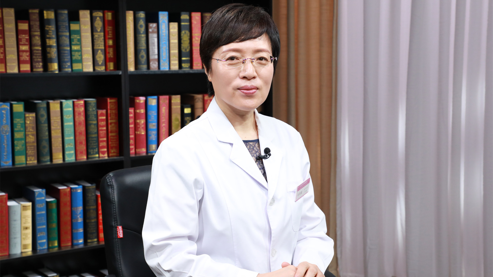

# 29.60 甲状腺癌的病理诊断

---

## 张晋夏 主任医师

北京大学首钢医院病理科主任 主任医师。

北京医师协会临床病理专科医师分会理事；北京肿瘤病理精准诊断研究会常务委员；北京肿瘤学会病理专家委员会委员；中国医师协会乳腺疾病专家委员会委员；北京医学会乳腺疾病专家委员会委员；中国医学促进会病理分会委员；美国德州大学MD Anderson癌症中心客座教授。

**主要成就：** 发表论文50余篇；曾承担及参与国家教育委员会肿瘤病理的基础与临床研究，承担区级及院内临床重点研究课题；曾获国家教委科技进步二等奖及区级科技进步三等奖。

**专业特长：** 擅长临床病理及肿瘤性疾病的病理诊断，尤其是乳腺、甲状腺、消化、呼吸及泌尿生殖系统等疾病的临床病理诊断。

---
