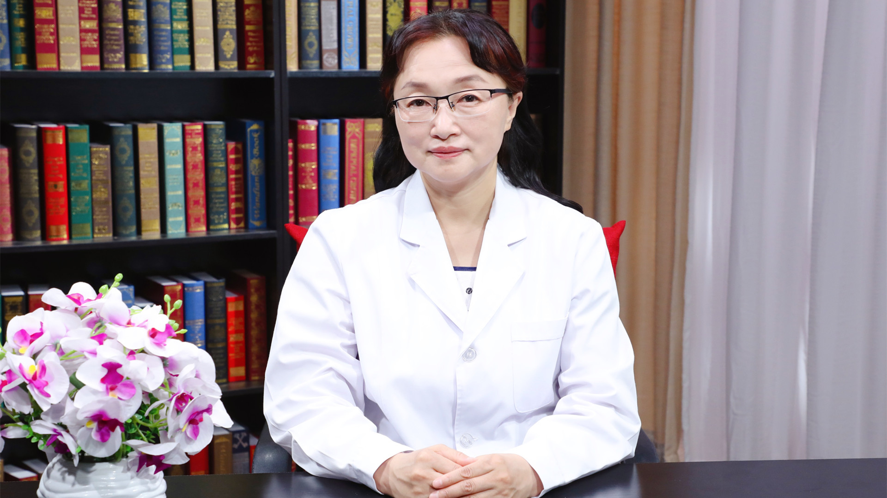

# 29.61 甲状腺癌的肿瘤标志物检查

---

## 崔巍 研究员

中国医学科学院肿瘤医院检验科主任 研究员 医学博士 博士生导师。

中华医学会检验医学分会副主任委员；北京医师协会检验医（技）师分会会长；中国医师协会检验医师分会常务委员；中国医师协会毕业后医学教育检验专业委员会总干事；《中华检验医学杂志》副总编辑。

**主要成就：** 主持国家自然科学基金面上项目4项、中国医学科学院创新工程项目1项、国家科技部子课题1项、北京自然科学基金面上项目1项、北京市科委基金1项等共16项；在国内外期刊发表文章150余篇；编著学术著作10余本，其中主编4本，副主编2本。

**专业特长：** 擅长临床基础检验及血液学检验、分子检验的实验室诊断及研究，尤其擅长对血常规、尿常规、凝血检验项目及分子检验项目的复检、报告审核和解读。

---
