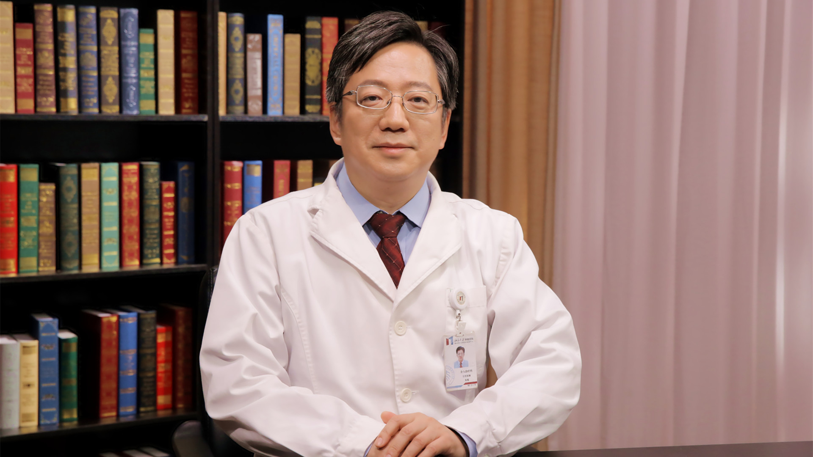

# 29.66 结直肠癌肝转移的介入治疗

---

## 朱旭 主任医师

北京大学肿瘤医院介入治疗科主任 主任医师 医学硕士 博士生导师。

中国抗癌协会肿瘤介入学专业委员会副主任委员；中国抗癌协会肿瘤介入学专业委员会肝转移癌与转化治疗专家委员会主任委员；中国医疗保健国际交流促进会肝脏肿瘤分会副主任委员；国家肿瘤微创治疗产业技术创新战略联盟—肿瘤冷冻消融与靶向治疗专业委员会主任委员；国家肿瘤微创治疗产业技术创新战略联盟专家委员会副主任委员。

**学术成就：** 承担国家自然科学基金面上项目、国家重点研发计划课题—肝肺肿瘤微创介入冷冻消融应用示范及其支撑技术规范化应用研究、首发基金自主创新项目；主持多项国内外多中心科研课题以及CGOS 基金项目、研究者发起的单中心前瞻性研究等科研课题；《CVIR》《WJG》审稿专家、《WJGO》编委及国内10余家核心期刊编委或审稿专家；
近5年发表学术论文30余篇，其中SCI收录论文17篇，参编论著4部。申请专利1项。

**专业特长：** 擅长影像引导下肿瘤微创介入治疗：原发性肝癌及转移性肝癌的区域动脉化疗及靶向治疗，肿瘤合并症的介入治疗等技术。主持并开展3-D CT引导下经皮椎体成形术、影像引导下肿瘤微波消融、冷冻消融治疗、放射性粒子植入等新技术，开展原发性肝癌及转移性肝癌的区域动脉化疗及靶向治疗，此方法处于国内国际领先水平。

---
