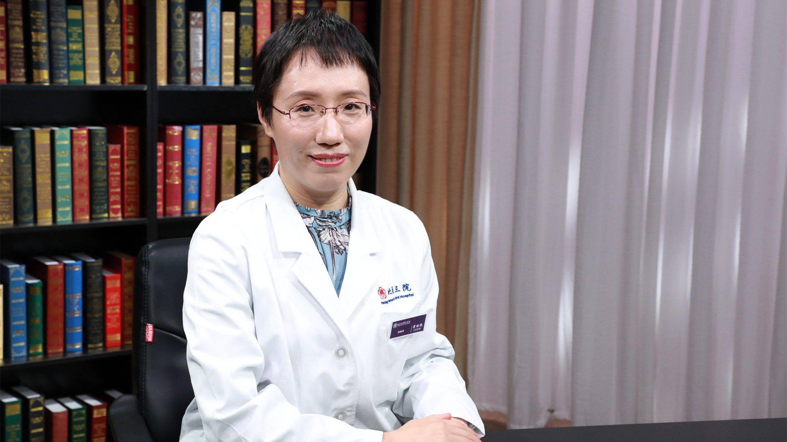

# 29.76 卵巢癌肿瘤标志物

---

## 崔丽艳 主任医师

北京大学第三医院检验科主任 主任医师 硕士生导师。

中华医学会检验医学分会免疫学组委员；中国医师协会检验医师分会委员；北京医学会检验医学分会常务委员兼秘书；北京医师协会检验医师分会理事。

**主要成就：** 发表SCI论文50余篇；获得国家自然科学基金2项，十三五子课题1项，院内课题多项。

 **专业特长：** 专业方向是临床免疫学检验，研究方向是生物标志物的筛选及相关机制研究；擅长感染免疫标志物、肿瘤标志物、自身免疫病相关抗体等检测的方法学及临床结果的解读。

---
