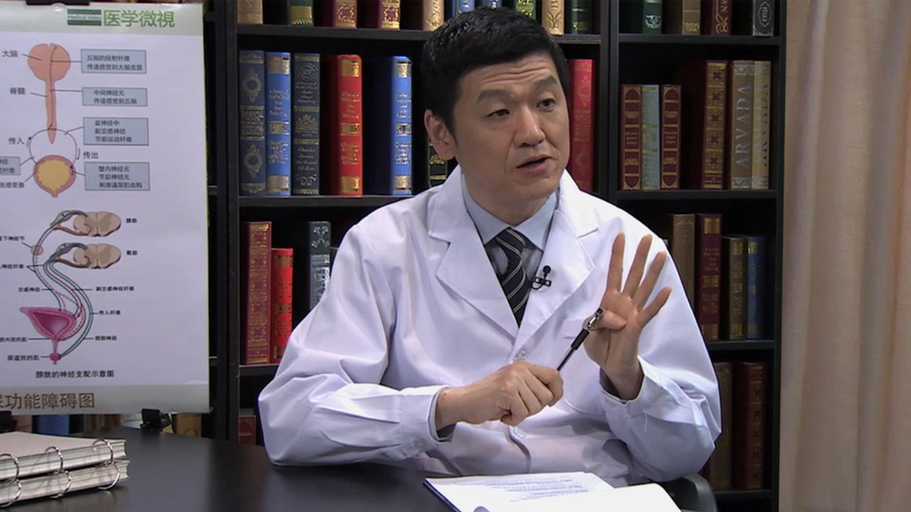

# 29.90 清洁间歇导尿技术

---

## 张勇 主任医师

首都医科大学附属北京天坛医院泌尿外科主任 主任医师 博士研究生导师。

首都医科大学泌尿外科学系副主任；中华医学会泌尿外科分会国际交流委员会委员；北京医学会泌尿外科分会常务委员；北京医学会男科学分会副主任委员。

**主要成就：** 主持国家级、省部级课题多项，发表第一作者或通讯作者论文50多篇，包括SCI收录论著30篇；主讲课程入选首都医科大学精品课程和优秀教学团队；参加编写著作9部，教材2部。

**专业特长：** 擅长排尿功能障碍，前列腺疾病，泌尿系统肿瘤、结石及男科等疾病的诊治，擅长用微创的方法诊疗泌尿外科疾病。

---
