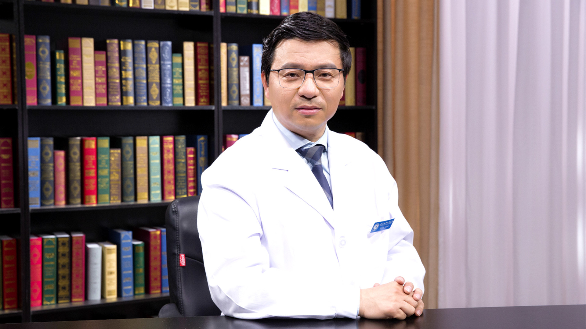

# 29.92 人工全髋、全膝关节置换术

---

## 林剑浩 主任医师

北京大学人民医院关节病诊疗研究中心主任 主任医师 博士生导师。

北大医疗康复医院骨关节病康复顾问；国家大骨节病和氟骨症治疗专家组组长；《首都十大疾病科技攻关与管理工作》脊柱和关节病领域领衔专家（2016-2020）；国际骨关节炎研究协会亚洲工作组主席 (Chair of OARSI Asian Task)；北京厚爱关节健康公益基金会理事长。

**主要成就：** 2007年所参与的《人工膝关节置换术的临床应用及相关基础研究》获得国家科技进步二等奖；2012年度北京大学人民医院优秀临床科主任、先进个人； 2013年度北京大学人民医院“名医奖”。

**专业特长：** 从事各种关节炎的外科治疗，特别是下肢髋、膝关节矫形。重点研究方向包括：骨关节炎流行病学调查、危险因素研究、骨关节炎运动康复治疗以及人工关节置换长期跟踪分析等领域。

---
