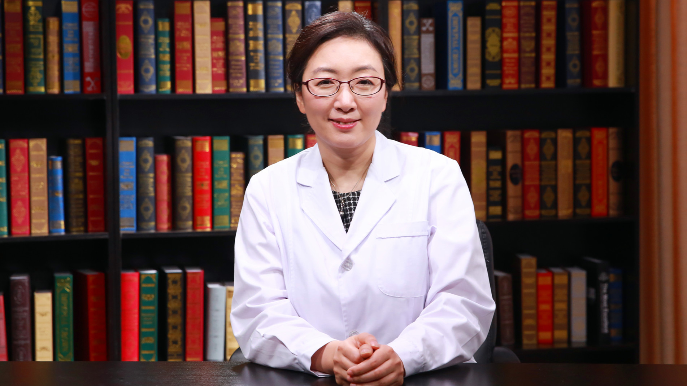

# 29.95 乳腺癌前哨淋巴结活检

---

## 王殊 主任医师

北京大学人民医院乳腺中心主任 主任医师 医学博士 博士生导师。

中国临床肿瘤学会乳腺癌专业委员会（CSCO-BC)常务委员；中国抗癌协会乳腺癌专业委员会(CBCSG)常务委员；中华医学会外科学分会乳腺外科学组委员；中国医师协会乳腺疾病专业委员会常委兼秘书长；中国医师协会乳腺疾病培训专家委员会常务委员；中国老年肿瘤学会乳腺癌专业委员会常务委员；中华预防医学会乳腺学组委员。

**主要成就：** 2006年美国M.D. Anderson肿瘤中心访问学者；2007年美国UMASS肿瘤中心博士后；承担多项国家自然科学基金及首都医学发展基金；国外及国内核心期刊发表文章数十篇。

**专业特长：** 擅长乳腺癌的综合治疗，在乳腺癌的外科、化疗、内分泌治疗、影像诊断及整形美容等方面有丰富经验。以最小有效治疗替代最大可耐受治疗，倡导乳腺癌患者的全程管理。开展荧光示踪前哨淋巴结活检这一手术，对其可行性、操作规范进行了深入的研究，证实该技术在中国乳腺癌患者中安全可靠，有显著的优势。

---
