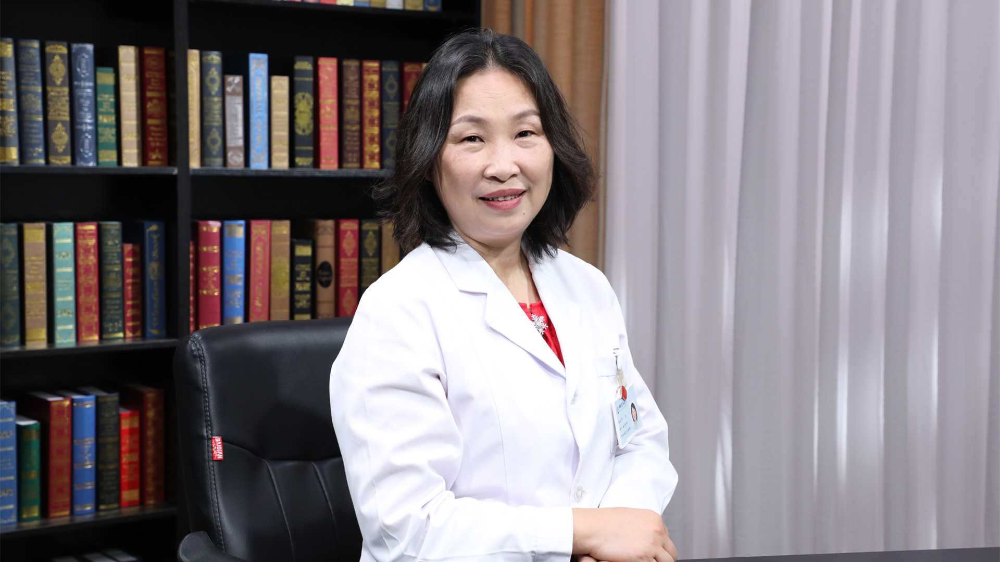

# 29.102 神经内分泌肿瘤的病理检查

---

## 罗杰 副主任医师

中日友好医院病理科副主任医师。

中华医学会病理分会头颈疾病学组委员；中国医学促进会神经内分泌肿瘤分会委员；CSCO神经内分泌肿瘤专家委员会委员；中国抗癌协会胰腺癌专业委员会神经内分泌肿瘤学组委员；中国研究型医院学会消化外科专业委员会NEN肿瘤学组常委。

**主要成就** ：2017年荣获卫计委颁发的“人民好医生”光荣称号。

**专业特长：** 在长期的临床医疗实践中积累了丰富的临床病理诊断经验，擅长神经内分泌肿瘤的病理诊断及研究。

---
