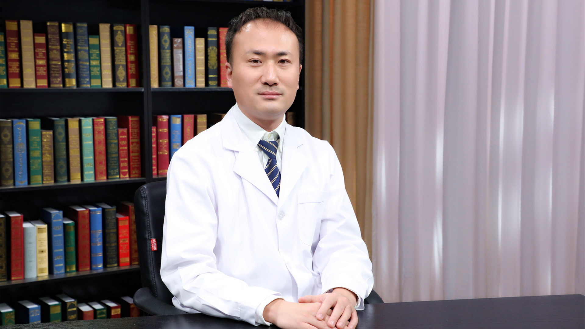

# 29.104 神经系统影像学检查

---

## 刘亚欧 主任医师

首都医科大学附属北京天坛医院放射科副主任（主持工作）。

国际视神经脊髓炎学会委员；亚太多发性硬化学会科学委员会委员；欧洲多发性硬化磁共振学会高级研究员；中华放射学会头颈专业学组委员。

**主要成就：** 在神经放射学、神经免疫影像学领域持续发表系列文章，共88篇（第一作者和通讯作者文章44篇），包括56篇SCI文章(第一作者和通讯作者31篇)，累计影响因子（IF）263.6分；曾获神经影像、多发性硬化领域国际和国内奖励和基金20多项；主持国家自然基金（面上项目，青年项目）和北京市自然基金项目等多个基金项目；获得国家“万人计划”青年领军人才（第四批），科技部“青年科技领军人才”，北京市“青年拔尖人才”、“科技新星”、“高创人才计划”、“国家人社部择优资助”等奖励和资助。

**专业特长：** 擅长神经影像学，研究方向为中枢神经系统免疫疾病以及脑白质病变的影像学。

---
