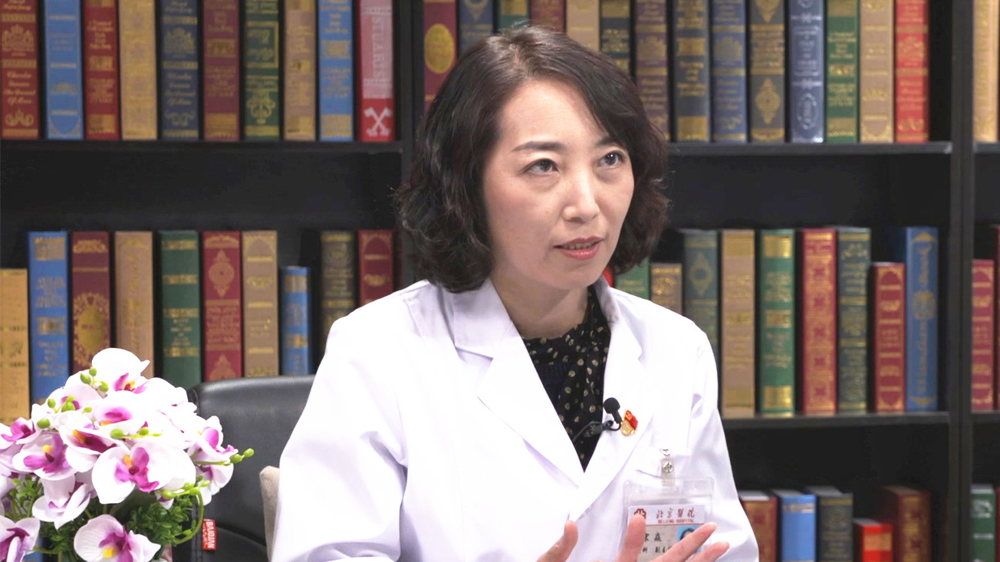

# 29.105 神经影像诊断

---

## 宋焱 副主任医师

北京医院放射科副主任 副主任医师 医学博士 硕士生导师.

中华医学会放射学分会神经专委会委员；中国卒中学会医学影像学分会委员；中国卒中学会脑血流与代谢分会委员；中国医师协会神经内科医师分会神经放射专委会委员。

**主要成就：** 曾在美国华盛顿大学访问学习；主要研究方向为颅内外动脉粥样硬化及缺血性脑卒中的磁共振研究、CT及MRI新技术在颅内外血管病变中的应用等；主持国家、省部级科研项目多项。

**专业特长：** 擅长全身各系统疾病的影像诊断，尤其是对神经系统疾病的影像诊断有深入的研究。

---
