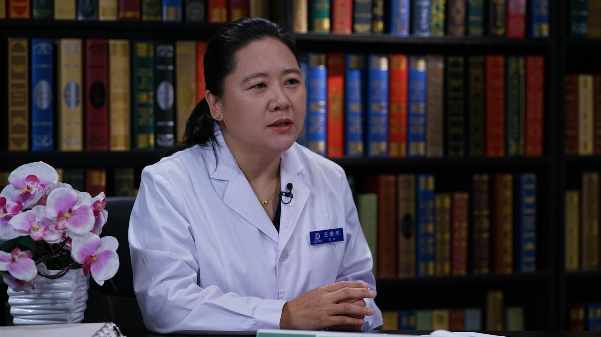

# 29.109 术前免疫八项检查

---

## 王雅杰 主任医师

首都医科大学附属北京地坛医院检验科主任 主任医师 医学博士 博士研究生导师.

中华医学会北京分会检验学分会青年委员会委员；中国生物化学与分子生物学会临床应用生物化学与分子生物学分会理事；北京神经内科学会基础研究分会常委；北京市自然项目评审专家。

**主要成就：** 奖励：获省级奖励2项；专利：作为第一发明人已授权专利9项，另有2项申请中；论著：参编《实验诊断学》《常用临床科研实验室技术及研究策略》等论著15部；论文：发表中英文文章百余篇，其中以第一作者或通讯作者发表SCI文章10篇，总影响因子33.866分。

**专业特长：** 主要研究方向：擅长实用性实验室新技术研发和应用、生物标志物筛选和应用、疾病相关蛋白质筛选和功能研究。

---
