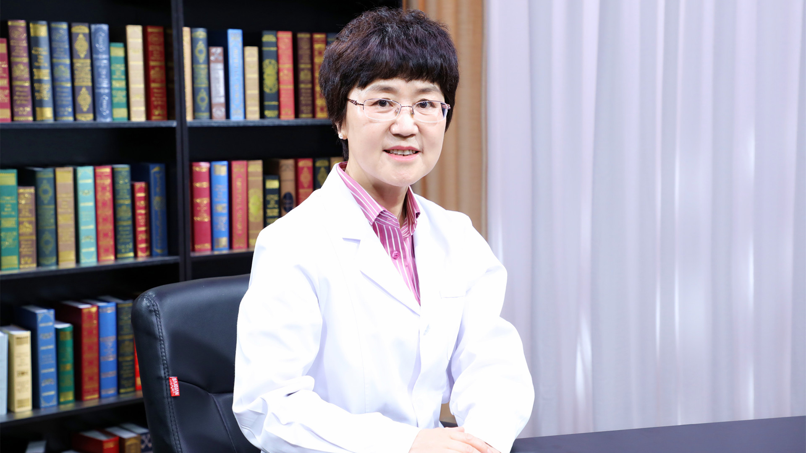

# 29.118 胃粘膜活检病理报告的解读

---

## 金木兰 主任医师

首都医科大学附属北京朝阳医院病理科主任 主任医师 博士生导师。

中华医学会北京分会病理专业委员会副主任委员；中国医师协会消化医师分会消化病理专业委员会副主任委员；中国研究型医院学会精准医学与肿瘤MDT专业委员会副主任委员；中华医学会病理学分会细胞学组组长 ；中国医师协会病理科医师分会委员；中国医师协会呼吸医师分会呼吸病理工作委员会委员。

**主要成就：** 近五年承担国家级项目、省级项目、局级项目共7项；作为主要完成者参与国家卫生计生委组织的三部诊断标准《中国胃癌诊断标准（2015版）》 《中国结直肠癌诊疗规范（2017版）》及 《食管、胃及结直肠早癌、癌前病变ESD标本的病理学评估标准（2018版）》的制定；参加了中华结核病学分会《中国结核病病理学诊断专家共识2017年版》、中华消化内镜学分会《中国消化内镜活组织检查与病理学检查规范专家共识2014年》及中华病理学分会《慢性胃炎及上皮性肿瘤胃粘膜活检病理诊断共识（2017版）》三部专家共识的制定；近5年来发表SCI论文20篇、国内核心期刊94篇。

**专业特长：** 擅长呼吸病理、消化病理、泌尿病理及妇科病理等诊断。

---
