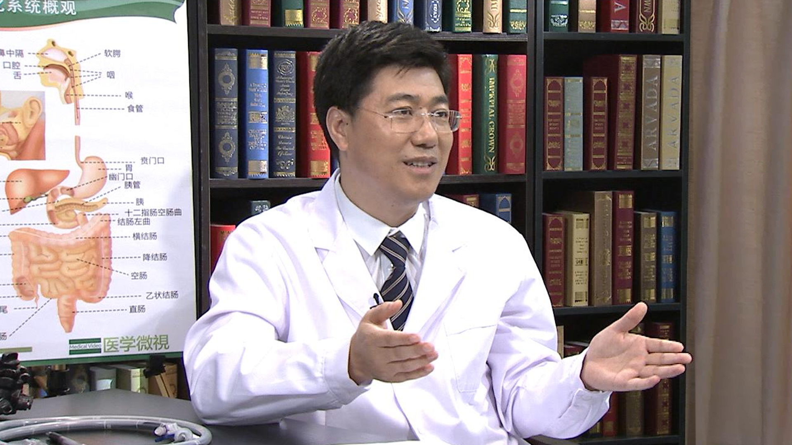

# 29.122 小肠镜

---

## 宁守斌 主任医师

中国人民解放军空军总医院消化科主任 全军小肠疾病内镜诊疗中心主任 主任医师 硕士研究生导师。

中华医学会消化内镜学分会小肠疾病学组组员;全军消化专业委员会委员;北京医师协会消化分会常务理事;中华临床医师杂志编委;世界华人消化杂志编委。

**主要成就：** 主持全军重大课题3项，国家863课题1项及其它多项部队及地方课题。

**专业特长：** 国内最早开展气囊辅助小肠镜的专家之一，近年来开展了多项世界领先的小肠镜治疗新技术。

---
