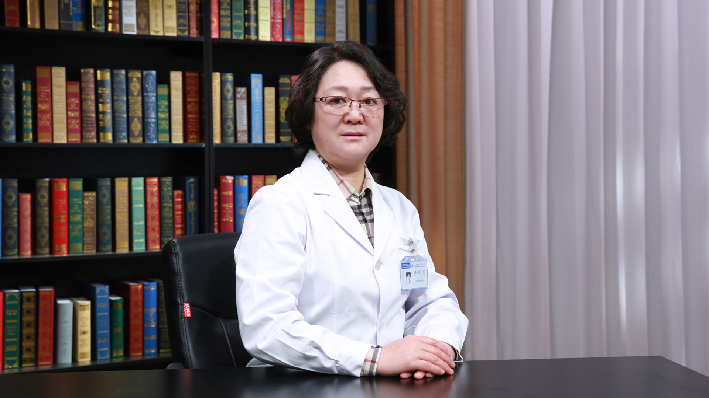

# 29.124 下肢水肿的超声检查

---

## 薛利芳 主任医师

北大医疗康复医院超声科主任 主任医师 硕士生导师 医学硕士。

北京大学国际医院超声科副主任；中国超声医学工程学会浅表器官及外周血管超声专业委员会常委；中国超声医学工程学会颅脑与颈动脉超声专业委员会常委；中华医学会超声医学专业委员会委员；北京医师协会腹膜后肿瘤分会理事；北京超声医学专家委员会常委。

**主要成就：** 发表论文30余篇，主编和主译医学专著5本，致力于超声基础及临床研究；参与北京大学分子医学研究所多项基础及临床研究。

**专业特长：** 擅长腹部、浅表器官、血管、以及各种疑难复杂性疾病的诊断与鉴别；目前主攻康复医学相关的超声检查及超声引导下的可视化微创治疗。

---
