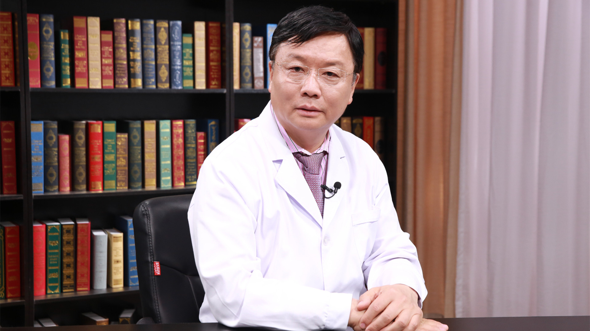

# 29.130 心血管影像学检查

---

## 赵世华 主任医师

中国医学科学院阜外医院磁共振影像中心主任 主任医师 博士生导师。

亚洲心血管影像学会委员会主席；中华医学会心血管分会常务委员兼影像学组长；中国医师协会放射学会心血管专委会主任委员；中华医学会放射学分会心胸专委会副主任委员；心血管影像学诊断和先心病介入两栖专家；欧洲心脏病和美国心脏病学会Fellow；科技部和国家自然科学基金委终审专家。

**主要成就：** 发表论文近400余篇，其中SCI收录论文86篇；引领团队建立了“基础-影像-临床”三结合科研模式；作为项目负责人获国家自然科学基金重点项目和重点国际合作等十余项科研基金；作为第一完成人获省部级成果奖共7项，包括教育部科技进步一等奖2项，中华医学奖二等奖2项，华夏医学奖一等奖1项；2015年获亚洲心血管影像学会（ASCI）金奖。

**专业特长：** 擅长心血管影像诊断，尤其是心血管磁共振诊断，对冠心病、心肌病、先心病、心律失常、肺动脉高压、心脏肿瘤、大血管疾病等具有很深造诣，对各类复杂疾病具有综合判断能力；擅长结构性心脏病介入治疗，包括房间隔缺损、室间隔缺损、动脉导管未闭、二尖瓣狭窄、肺动脉瓣狭窄、心外畸形等介入治疗。

---
