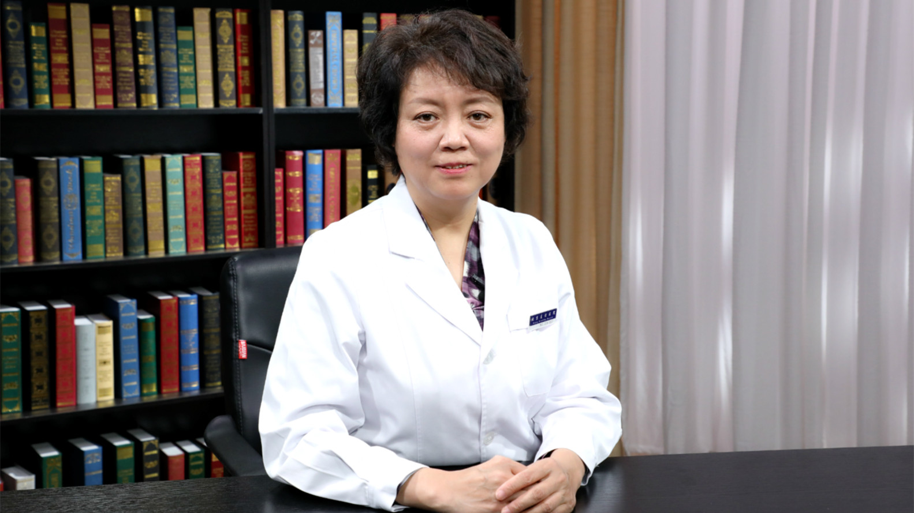

# 29.142 药敏试验

---

## 苏建荣 主任医师/教授

首都医科大学附属北京友谊医院检验中心主任 主任医师 教授 博士生导师。

国家临床重点检验专科建设项目学科带头人；中华医学会北京检验分会副主任委员；中国微生物学会临床微生物学专业委员会副主任委员（第一、二届）；中国医疗器械行业协会临床质谱创新发展分会副主任委员；中国博士后科学基金、国家科学技术奖励评委会等评审专家。

**主要成就：** 获得国家自然科学基金等重点项目资助，两次获得北京市科技进步奖等；近年发表SCI论文和核心期刊论文100余篇，主编、主译、副主编著作9部。

**专业特长：** 擅长微生物感染的病原诊断与抗菌药物合理使用。在临床微生物感染诊治、人体微生态特征、医院感染控制、抗菌药物耐药机制以及实验室质量控制等方面有深入研究。

---
