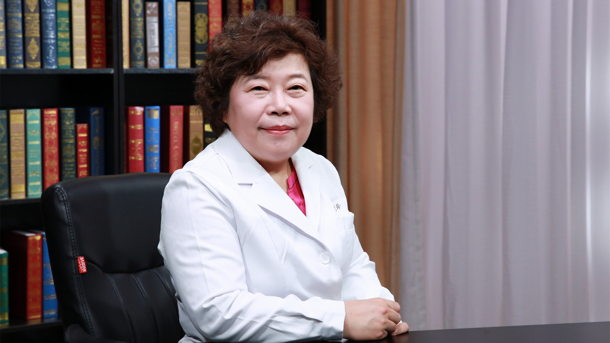

# 30.17 极长链酰基辅酶A脱氢酶缺乏症

---

## 杨艳玲 主任医师

北京大学第一医院儿科主任医师 研究员 博士生导师。

北京医学会罕见病分会遗传代谢病学组组长；北京医学会儿科分会内分泌遗传代谢学组副组长；中华医学会儿科分会临床营养学组副组长；中华预防医学会出生缺陷预防与控制专委会常委 新生儿筛查学组副组长 ；中国医师协会儿科分会神经修复学组副组长 ；亚洲遗传代谢病学会理事。

**主要成就：** 致力于神经精神相关遗传代谢与内分泌疾病的诊断、治疗与防控研究；主持3项国家自然科学基金项目、1项国家重大研发计划课题，参与5项国家级研究项目；2017年荣获第十届宋庆龄儿科医学奖，发表论文200余篇，参与编写10余部学术专著。

**专业特长：** 遗传代谢、内分泌疾病的临床诊治与防控，生长发育相关疾病的诊断与干预。

---
