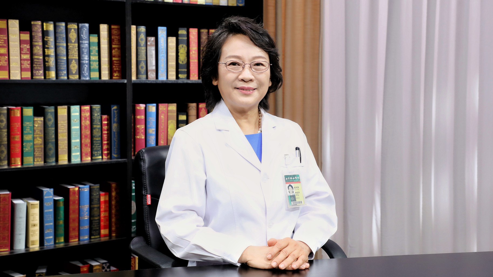

# 30.22 肌萎缩侧索硬化症（渐冻症、运动神经元病）

---

## 崔丽英 主任医师

北京协和医院神经病学系主任 主任医师 教授 博士生导师。

中华医学会神经病学分会主任委员；中国医师协会神经病学分会副主任委员；北京医师协会神经病学分会主任委员；世界神经病学联盟肌萎缩侧索硬化协作组委员；《中华神经科杂志》名誉总编。

**主要成就：** 曾作为牵头人获北京市科技三等奖1项、中华医学科技三等奖2项、教育部科技二等奖1项等；作为参加者获得国家科技奖2项；发表SCI论文100余篇。

**专业特长：** 致力肌萎缩侧索硬化临床、电生理、基因和治疗方面的研究以及神经肌肉病的临床神经电生理等方面的研究；擅长各种神经系统疾病的诊疗，特别是运动神经元病、周围神经病、肌肉病、神经肌肉接头病等神经系统罕见疾病的诊治。

---
