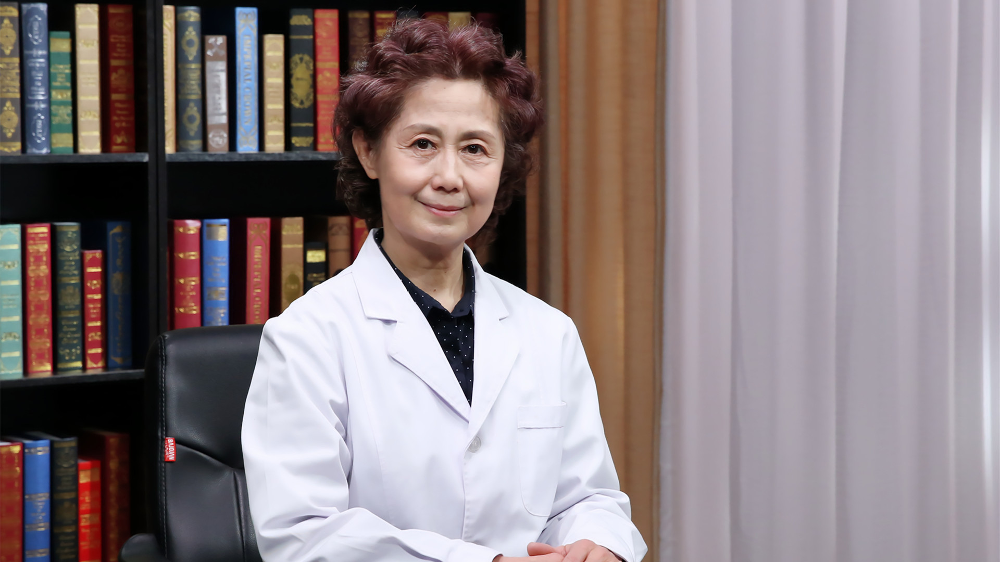

# 30.28 什么是罕见病

---

## 王琳 主任医师

曾任北京市第六医院副院长 主任医师.

国家卫健委罕见病诊疗与保障专家委员会委员 ；北京医学会罕见病分会副主任委员；《中国罕见病研究报告2018》并列主编 执笔人；历任九三学社第十一 十二届中央委员；九三学社北京市委员会常务副主委（正局级）；全国妇联第九届执委；北京市人大第十三届常委；北京市政协第八 九届委员 政协第十届常委 副秘书长。

---
