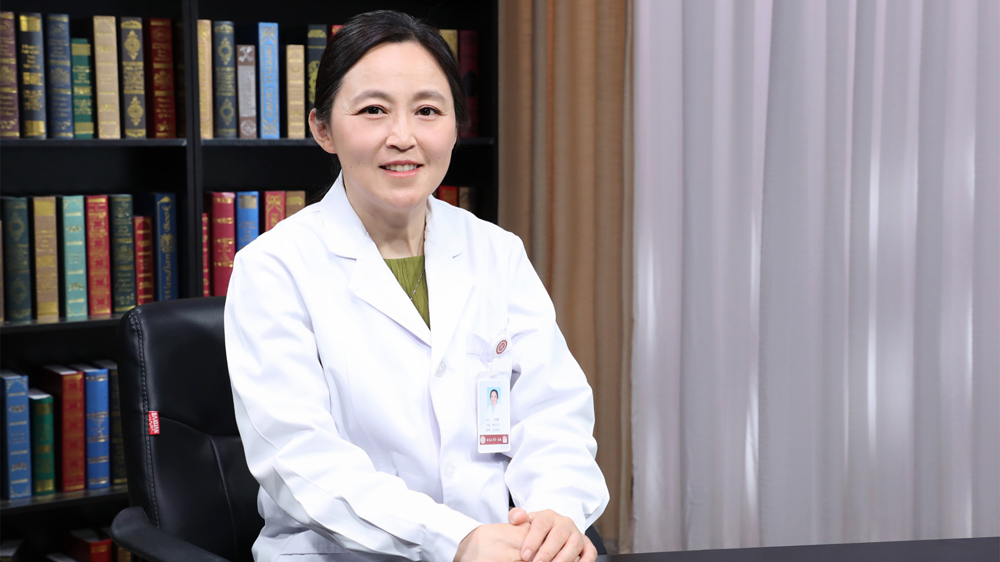

# 30.32 线粒体脑肌病

---

## 王朝霞 主任医师

北京大学第一医院神经内科副主任 主任医师 博士生导师。

中华医学会神经病学分会神经肌肉病学组委员；北京医学会罕见病分会委员兼秘书；北京医学会神经病学分会委员；《中国现代神经疾病杂志》编委。

**主要成就：** 发表论文50余篇；获得国家级项目3项，省部级项目1项支持。

**专业特长：** 擅长线粒体病、神经肌肉病、神经遗传病、帕金森病等神经系统疾病的诊断与治疗。

---
