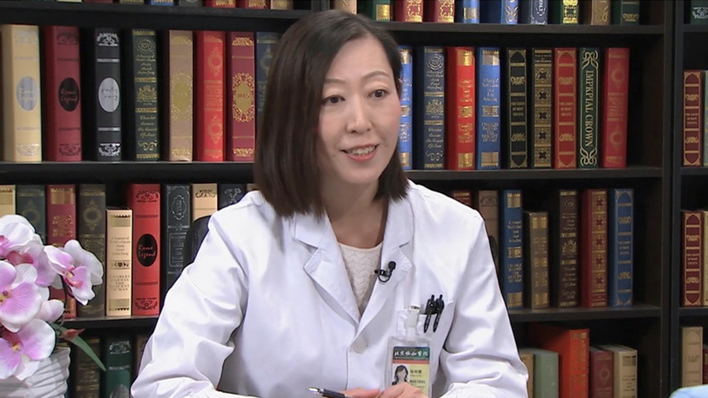

# 30.37 血友病性骨关节病

---

## 陈丽霞 主任医师

北京协和医院康复科主任 康复医学主任医师 教授 硕士生导师。

北京协和医院保健医疗部副主任；北京协和医学院理疗与康复学系副主任；中华医学会物理医学与康复分会常委 秘书长；中国医师协会康复医师分会常务理事；中国健康与教育促进会运动与康复分会副主任委员；中国康复医学会理事；中央保健委员会会诊专家；北京物理医学与康复分会常委；北京康复医学会常务理事；北京市康复医疗质量控制与改进中心副主任；中国血友病中心协作组物理治疗小组组长。

**主要成就：** 在国内率先开展血友病骨关节功能评定和物理治疗，担任中国血友病诊疗中心协作网（HTCCNC）物理治疗组组长，并对国内20余家血友病中心的相关专业人员进行培训；参与项目《血友病综合防治体系建设》获中华医学科技奖三等奖及北京市科学技术奖三等奖（2011年）；发表核心期刊与SCI论文30余篇，牵头主持国内外基金课题多项，参编多部专业书籍，主编《物理医学康复科诊疗常规》第二版。

**专业特长：** 擅长骨关节系统疾病、神经系统疾病、老年病、血友病、心肺疾病的功能评定、物理治疗与康复。曾赴美国加州大学旧金山分校、美国约翰霍普金斯老年医学中心、新加坡中央医院、香港威尔士亲王医院进修学习。

---
