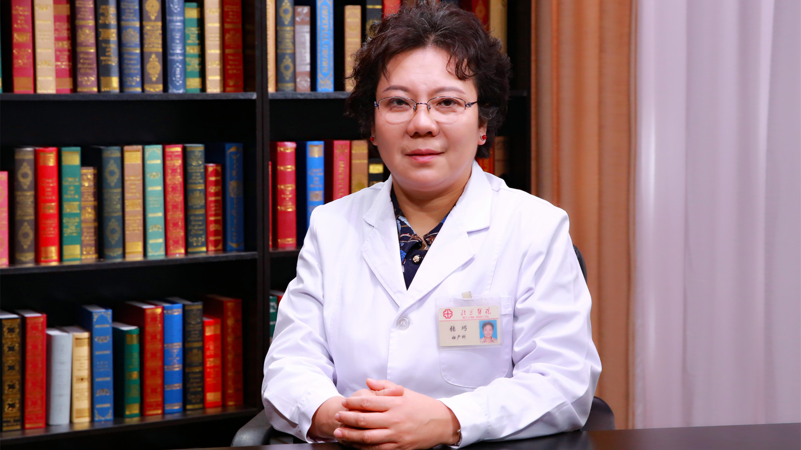

# 31.14 青少年性教育

---

## 张巧 主任医师

北京医院妇产科 主任医师 教授 知名专家。

全国妇幼健康研究会科普专委会主任委员；中华医学会计划生育学分会委员；北京医学会计划生育学分会副主任委员；国家医药监督总局医疗器械分类技术委员会妇产科 辅助生殖和计划生育器械专业组组长；《生殖医学杂志》《中国计划生育学杂志》《中国计划生育和妇产科》编委；《生殖健康咨询师教材》编审委员会委员。

**主要成就：** 在美国西北大学医学院（Northwestern University, Feinberg School of Medicine）工作学习4年，获得美国妇产科超声专业执业证书；参与国内外多项科研工作，在国内外学术期刊发表多篇论文；多次获“优秀教师”称号及教学比赛一等奖；获北京医院巾帼建功标兵。

**专业特长：** 擅长不孕不育、计划生育、妇科内分泌疾病、宫腔病变的诊断和治疗；注重妇产科微创性手术，善于应用超声及内窥镜技术诊治妇科疾病，尤其擅长各种疑难的计划生育手术、不孕相关手术；在更年期保健及绝经相关疾病的预防和治疗方面积累了丰富的经验。

---
