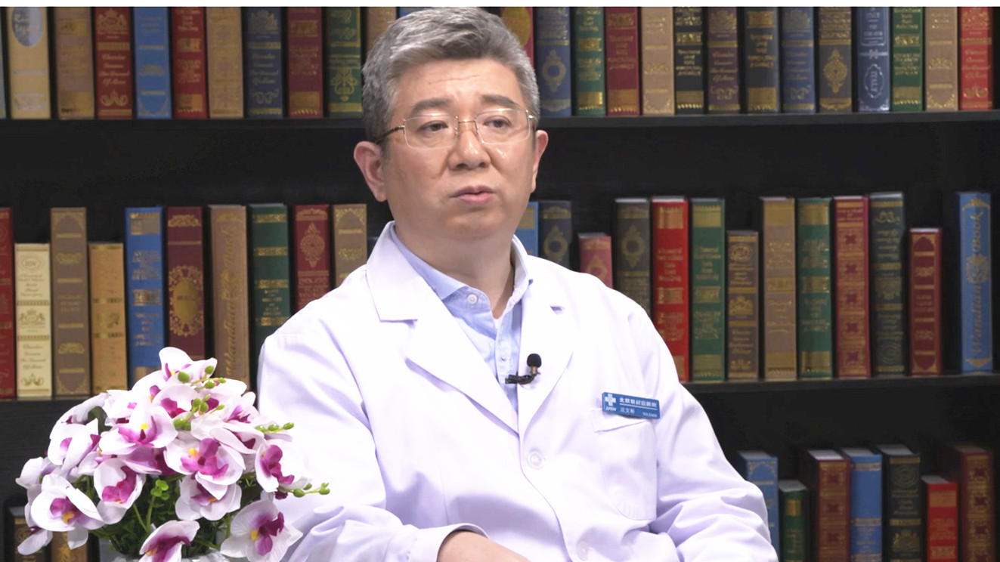

# 31.18 乳糜胸

---

## 沈文彬 主任医师

首都医科大学附属北京世纪坛医院淋巴外科主任 主任医师 学科带头人。

中华医学会整形外科学分会淋巴水肿诊疗专业组副组长；中国医师协会腔内血管学专业委员会淋巴疾病专家委员会主任委员；中国中西医结合学会周围血管疾病专业委员会淋巴学组副主任委员;国家卫健委能力建设和继续教育淋巴循环障碍疾病诊疗专项能力培训项目专家组副组长。

**主要成就：** 30年来，致力于淋巴回流障碍的临床研究：倡导淋巴管疾病诊断优先理念，建立了以手术显微镜下淋巴管造影术和淋巴管系全程动态影像、核素淋巴显像、淋巴乳糜定量分析、淋巴管造影后的CT影像、核磁共振淋巴干影像等为代表的专业诊疗体系；完善了以显微淋巴回流重建为主导的综合外科治疗模式，尤其是分期手术治疗淋巴水肿模式取得良好成果；建设了国内第一个淋巴外科专业病区，在乳糜回流障碍疾病领域，积累了丰富经验；通过上万病例的诊疗总结，初步完成淋巴循环障碍疾病谱构建。

**专业特长：** 擅长各类淋巴水肿和乳糜回流障碍的诊治。

---
