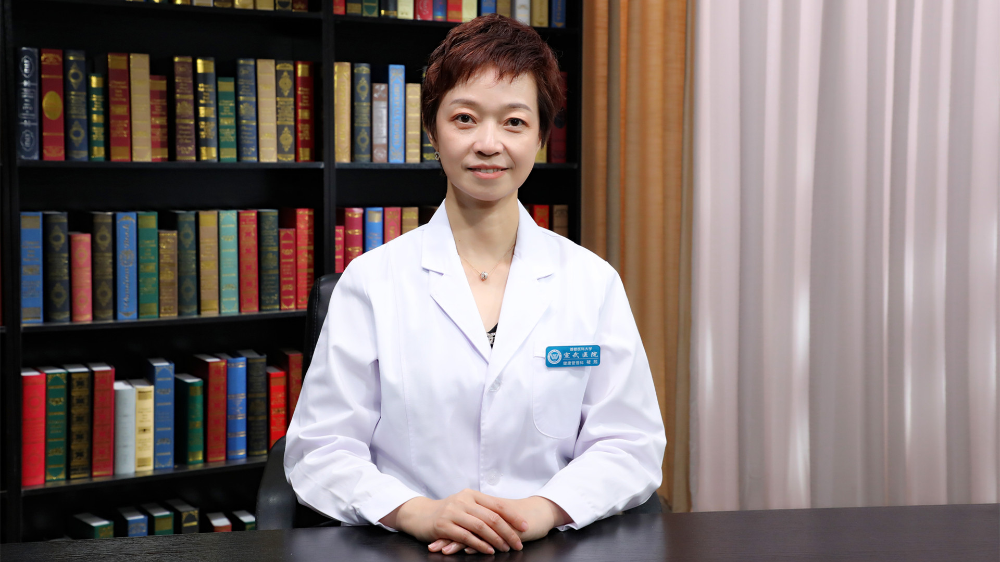

# 31.21 体检//褚熙教授

---

## 褚熙 主任医师

首都医科大学宣武医院健康管理科主任 主任医师 心内科医学博士 硕士生导师。

中华医学会健康管理学分会常务委员；北京医师协会健康管理专家委员会常务副主任委员；中华预防医学会健康促进与教育分会常务委员；中国老年医学学会健康管理分会常务委员；《中华健康管理学杂志》编委。

**主要成就：** 发表SCI论文、核心期刊论文30余篇；承担国家级及省部级科研项目10余项，主编学术专著4部；2017年获第一届“国之名医•青年新锐”称号；2020年获第七届“北京优秀医师”称号。

**专业特长：** 主要从事动脉粥样硬化的临床及机制研究、慢性病的健康管理工作。

---
