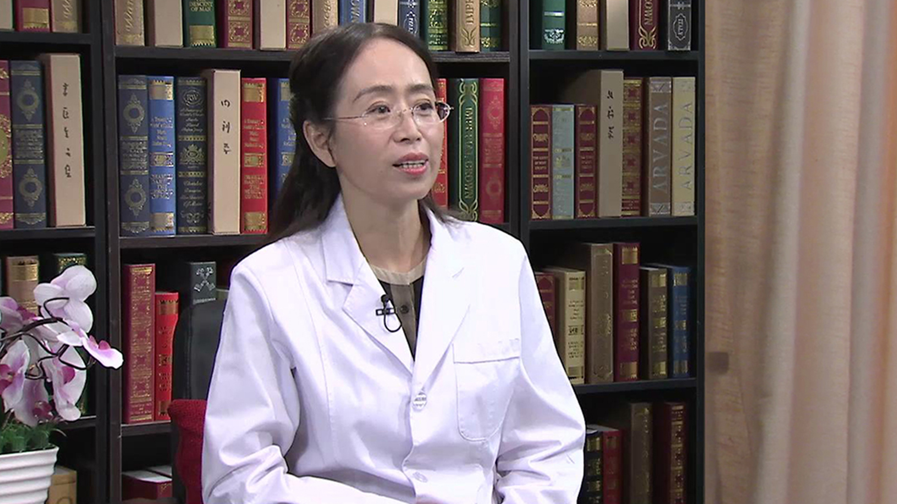

# 31.22 体检//王莹教授

---

## 王莹 副主任医师

首都医科大学附属北京朝阳医院健康体检中心副主任 副主任医师。

**主要成就：** 承担科研项目2项；在国际较权威杂志发表血脂异常的论文等。

**专业特长：** 对高血压、冠心病、心力衰竭、高脂血症等心血管疾病具有丰富的临床经验及诊治水平，并从事健康体检、健康管理及擅长对高血压、高脂血症、糖尿病、心脑血管疾病的有效预防工作。

---
