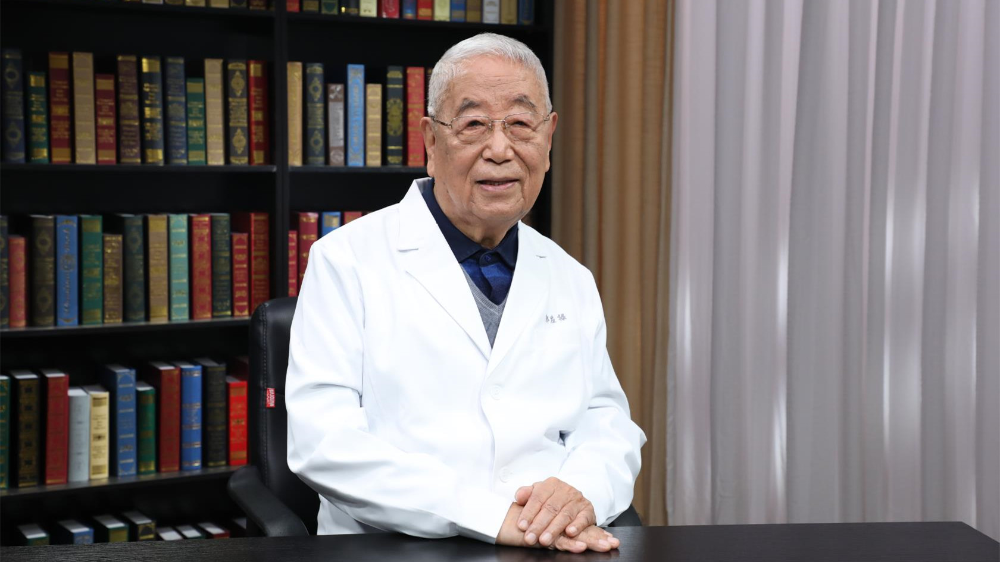

# 31.25 微能量医学

---

## 郭应禄 院士

中国工程院院士  北京大学第一医院名誉院长。

国家泌尿男生殖系肿瘤研究中心主任；北京大学泌尿外科研究所名誉所长；北京大学泌尿外科医师培训学院院长；北京大学男科病防治中心主任。

**主要成就：** 主编著作32部，论文500余篇，获部委级成果20余项；我国泌尿外科和男科学学科带头人，著名医学科学家、教育家；以其开创性工作为推动中国泌尿外科事业的发展做出了卓越贡献，现致力于创立无创微能量医学事业，以期使中国在第三次生命科学革命浪潮中走在世界前列。

---
