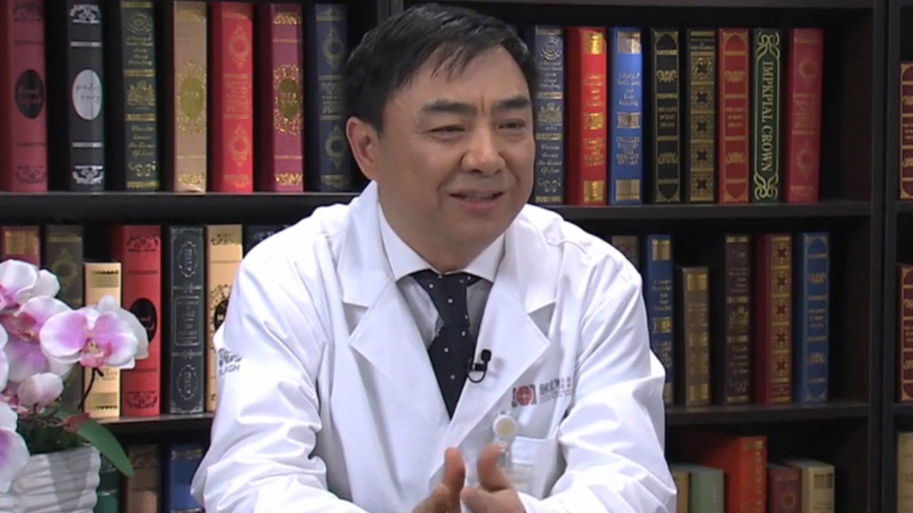

# 31.27 献血

---

## 汪德清 主任医师

中国人民解放军总医院输血科主任 主任医师 博士生导师。

全军临床输血中心主任 ；中华医学会临床输血学分会侯任主任委员；中国医师协会输血科医师分会副会长；全军血液管理专业委员会副主任委员；中国输血协会临床输血管理委员会副主任委员；北京医学会输血医学分会主任委员。

**主要成就：** 先后承担并参与国家和军队多项课题；获北京医学科技一等奖1项；省部级科技进步二等奖6项、专利授权10项；发表论文200余篇，其中SCI收录20余篇，论文被引400余次；主编专著5部。

**专业特长：** 擅长临床输血（急重症输血、大剂量输血）。

---
