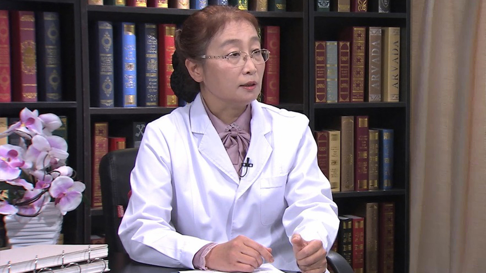

# 31.28 亚健康与大众健康管理

---

## 于健春 主任医师

中国医学科学院北京协和医院基本外科副主任 主任医师 博士生导师。

中华医学会肠外肠内营养学分会主任委员 ;中华医学会外科学分会营养支持学组副组长 ;中国医师协会外科医师分会临床营养医师委员会副主任委员。

**主要成就:** 曾荣获 1996、2002年度卫生部、北京市及国家级科技进步二等奖；2010年、2016年度北京医学会突出贡献奖；2012年度北京市科学技术成果三等奖；2013年荣获华夏医学科技成果二等奖；发表文章100余篇；主编及参编专业书14部，主编继续教育专著6本；主编科普专著1本。

**专业特长:** 主要从事普外科，特别是胃肠外科与营养代谢专业，以及相关的临床和基础研究工作。作为主要研究者完成多项全国多中心临床营养研究；开展营养风险筛查与营养规范治疗，擅长胃肠肿瘤化疗与免疫营养研究，腹腔镜微创手术、减肥手术与多学科综合治疗，使老年病人、胃肠肿瘤、炎性肠病、放射性肠炎、短肠综合征、肠瘘及肥胖症病人受益。

---
