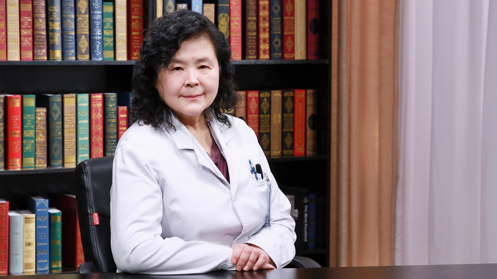

# 31.29 优生遗传咨询

---

## 王树玉 主任医师

首都医科大学附属北京妇产医院生殖医学科  总负责人 主任医师 博士生导师。

北京市重点学科带头人 享受国务院政府津贴；中国医师协会生殖医学专业委员会副主任委员；中国优生科学协会常务委员兼学术部副主任；中国出生缺陷预防专业委员会副主任委员；中国遗传学会委员；中华医学会遗传分会委员。

**主要成就：** 北京妇产医院生殖医学科创史人，诞生北京市级医院首例试管婴儿；作为卫生部重点课题首席，牵头全国55家产前诊断中心，首次进行国产FISH探针产前诊断临床应用；承担国家科技进步奖、华夏医学奖、国家人类辅助生育技术和人类精子库等评审专家；获中国卫生医药事业基金会杰出研究奖、中国妇幼卫生科技成果奖三项等。

**专业特长：** 擅长优生遗传咨询、遗传病诊断及产前诊断、疑难病例会诊异常报告鉴定；不孕不育症诊治、各种助孕技术及内分泌异常诊治。

---
