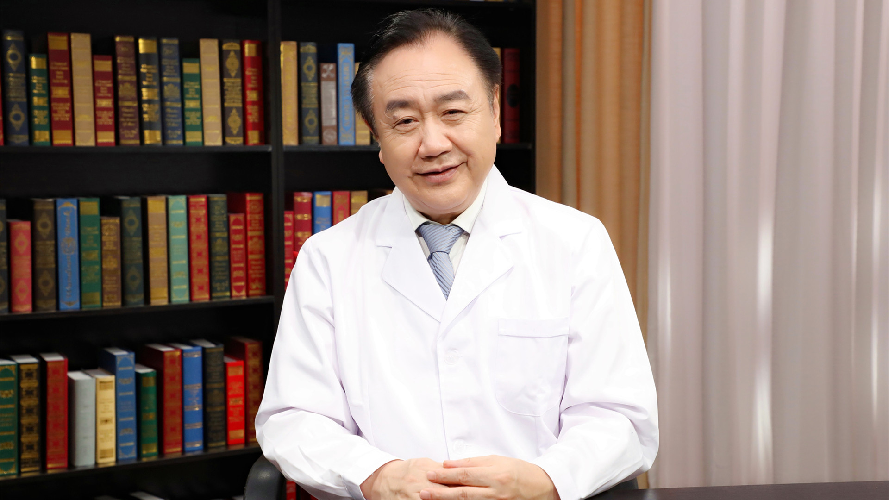

# 31.30 整合医学

---

## 樊代明 院士

空军军医大学西京消化病医院院长。

美国国家医学科学院外籍院士；中国工程院原副院长；中华医学会消化病学分会原主任委员；亚太消化病学会主席；中国抗癌协会理事长；肿瘤生物学国家重点实验室主任；国家消化系统疾病临床医学研究中心主任。

**主要成就：** 荣立三等功1次、二等功1次，2010年经中央军委批准荣立一等功；先后承担国家973首席科学家项目、863项目、国家攻关项目、国家重大新药创制、国家自然科学基金首批创新研究群体基金、工程院重大咨询项目等课题；获国家科技进步创新团队奖，国家科技进步一、二、三等奖各1项，国家技术发明奖1项，军队科技进步一等奖2项，军队教学成果一等奖1项，陕西省科学技术一等奖2项，国家发明专利39项、实用新型专利18项，国家新药证书1项；主编专著31本，担任全国高等医学教育数字化教材（53册）、临床医学基础精读系列丛书（10册）和《肿瘤研究前沿（19册）》的总主编。

**专业特长：** 长期从事消化系疾病的临床与基础研究工作，并致力于医学发展的宏观战略研究，在国际上率先提出整体整合医学理论并付诸实践。

---
