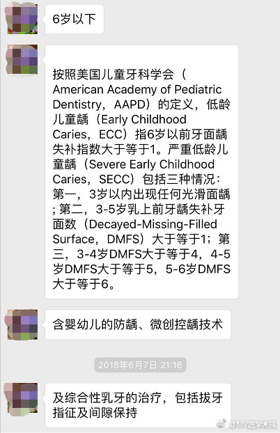

幕后
====

录制到深夜将近12点的科普
------------------------

夜里11点42分，或许有人已经入睡，或许有人还在熬夜玩手机，但对于陈香美院士和医学微视团队来讲，《IgA肾病》科普视频的录制却刚刚结束
。

从晚上八点多开始一直录到深夜十一点多，我国肾脏病学专家陈香美院士从莅临医学微视，就一直在十分认真细致地讲解关于IgA肾病的科普知识。

陈院士从医四十余年，为了攻克IgA肾病付出了许多努力。她说，她有两个理想，一是不做肾活检也能把IgA肾病诊断清楚，二是寻找到真正对于IgA肾病有作用效果的靶点药物！就算自己这代人可能无法完全达到这两个理想，她也在坚持不断钻研，一直在路上！

致敬！

患者留言回复啦！
----------------

上周我们联系北京首钢医院普外科刘京山主任，告知医学微视官网上有新留言，麻烦主任抽空回复，主任爽快答应了，并表示感谢医学微视提供了患者与医生交流的平台。
当天夜里十一点多，我们就看到了主任的回复，感动感动！有留言提问《胆结石》的朋友，赶紧看一看吧\ :sub:`主任给你回复啦`

“80后”细心又耐心的陈奶奶　
--------------------------

前两天去拜访首都儿科研究所附属儿童医院哮喘防治中心主任医师陈育智教授，陈教授今年85岁了，每周还在坚持出诊。
这个季节正是疾病多发的季节，我们早晨到达儿研所的时候，科室里全是小朋友。
大家都知道，小朋友多的地方，总是像小麻雀聚集的地方，叽叽喳喳闹成一片，我们的陈奶奶在一众小朋友中间，面容慈祥，既细心又耐心，没有半点不耐烦。
我们在诊室一旁静静等教授给小患者们看完病后，才把陈教授在医学微视录制的科普视频卡片交给她，教授看了特别高兴，说，“这个真好呀，可以给患者看，还可以教学，我用完了你们还给做不？”
教授看着我们说这话的时候，真的是敲可耐！ 做！必须做！
随后教授把『医学微视』的视频推到了好几个微信群，一直夸赞我们「医学微视」真好……这一点，大家也学习一下

为什么成人的药减量也不可以给孩子吃？　
--------------------------------------

为什么成人的药减量也不可以给孩子吃？
我们在专访北京协和医院张继春主任的时候，她给我们说了这样一个例子：之前有一位飞行员咳嗽非常厉害，干咳，无痰，吃过很多药都没有效果，后来他去了某医院，医生给他开了两片可待因。
可待因具有麻醉性，能够镇咳、镇痛，因为属于国家管制药，所以只给了两片，且医生再三叮嘱，一定要保管好！
飞行员回家以后只吃了一片，咳嗽好了，然后他就跟她老婆说，“我咳嗽吃什么药都不好，x医院给的两片可待因，只吃了一片就好了，效果真好。”
他老婆就说：“咱儿子也咳嗽，可以试试。”
于是他们擅自掰了半片药，研碎了，用手指头蘸着药面，用水给孩子喂了，这孩子才三个月，喂完药半小时后，孩子面色青紫，经抢救无效，孩子死了，后来这位飞行员的夫人也疯了，因为她觉得是自己亲手杀死了自己的孩子。
这样惨痛的教训摆在咱们面前，所以做家长的一定要记住：孩子不是缩小版的成人！儿童有儿童专用药，儿童药也有儿童专用剂型，成人的药不可以直接减量喂给孩子吃！！！

.. figure:: image/c32_01/1678287414663.png
   :alt: 1678287414663

   1678287414663

飞越大半个中国，只为做一次科普　
--------------------------------

南方医科大学口腔医院（广东省口腔医院）口腔健康保健中心主任任飞教授受邀来医学微视拍摄《重度低龄儿童龋齿》，话题确定以后，教授立刻开始准备讲解方向并准备相关资料与我们的工作人员沟通，因为教授日常工作忙，为了如期拍摄，教授下了门诊连夜坐飞机从广东飞到北京，结束以后又飞回去工作。如此辛苦，教授却说，“我喜欢科普这样的话题，因为这样可以帮到更多的人。”

   1678287460581
